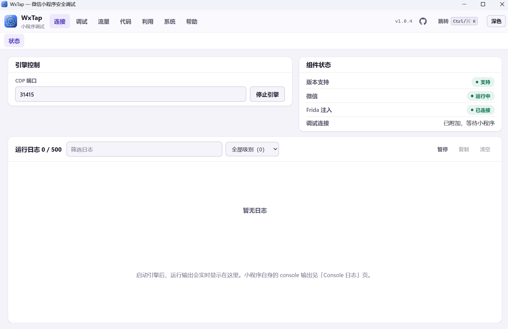
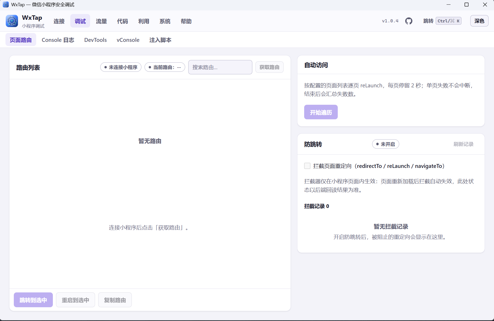
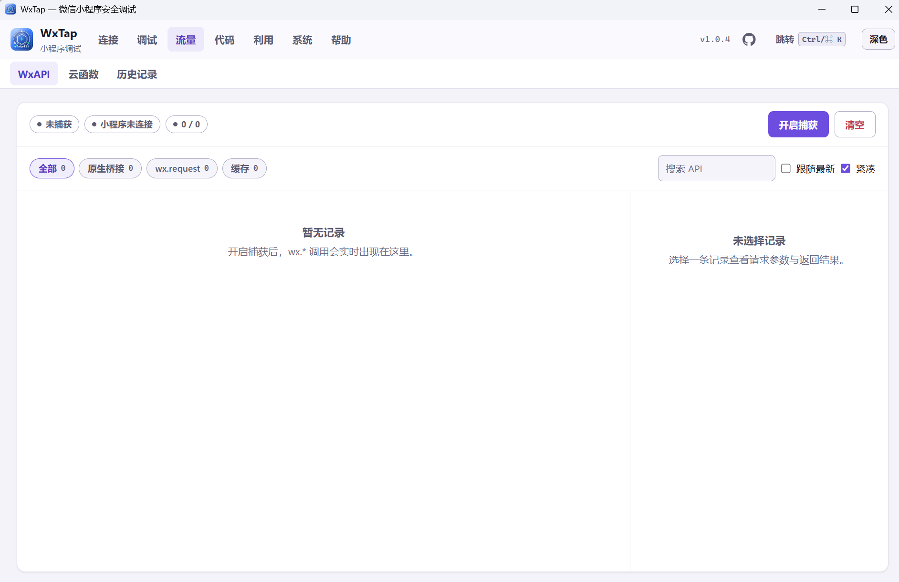
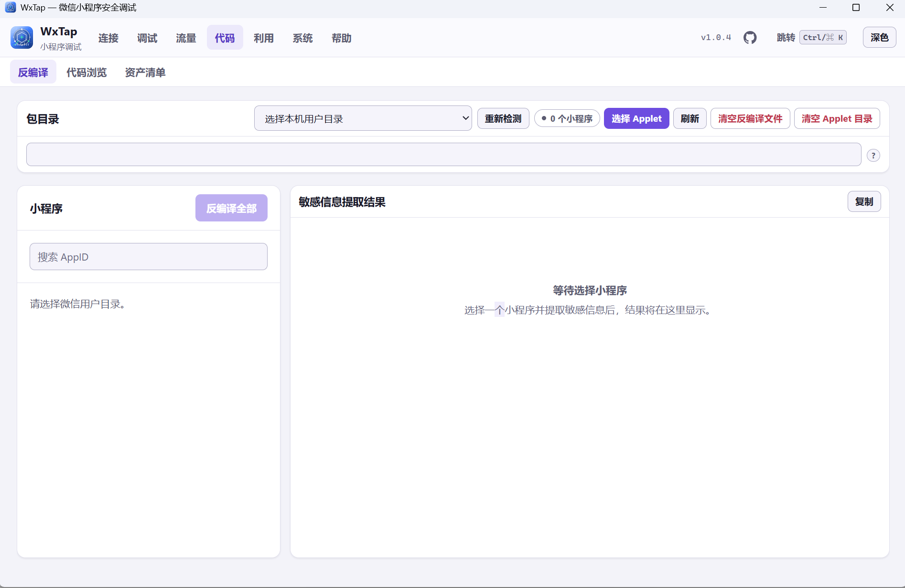

# WxTap

**微信小程序安全调试工作台 · 桌面 GUI + MCP**

WxTap 面向自有或已获书面授权的微信小程序，将运行时调试、接口与云函数捕获、源码还原和资产整理集中在一个桌面工作台。你可以通过界面排查问题，也可以通过 MCP 将这些能力接入智能体工作流。

[下载最新版](https://github.com/langbyyi/wxtap/releases/latest) · [快速上手](#快速上手) · [能力总览](#能力总览) · [文档](docs/README.md) · [问题反馈](https://github.com/langbyyi/wxtap/issues)



## 适用场景

| 你想解决的问题 | 使用方式 |
| --- | --- |
| 页面跳转异常、运行时出错，或反复被 `debugger` 中断 | 查看页面路由和 Console，使用 DevTools 定位代码，按需跳过暂停 |
| 接口或云函数调用失败，需要核对参数与返回值 | 开启捕获，查看请求、响应、耗时与错误，按原参数重放 |
| 安全测试前需要了解源码与接口分布 | 还原受支持的小程序包，全文检索源码，扫描敏感信息，整理并导出资产清单 |
| 需要让智能体协助分析小程序 | 启动 MCP 服务，接入客户端，调用路由、流量、源码等工具 |

## 安装（发布包）

| 平台 | 下载 | 支持情况 |
| --- | --- | --- |
| Windows 10/11 x64 | [WxTap-setup.exe](https://github.com/langbyyi/wxtap/releases/latest/download/WxTap-setup.exe) | 当前主要交付平台；微信构建需在支持范围内 |
| macOS Apple Silicon | [WxTap.dmg](https://github.com/langbyyi/wxtap/releases/latest/download/WxTap.dmg) | 已提供安装包，微信挂钩能力受限，安装前请阅读 [平台说明](docs/PLATFORM.md) |

运行前准备：

- **Node.js 22 或更新版本**：发布包不内置 Node；可在「设置」页检测或指定运行时路径。
- **微信桌面端**：已登录，并打开自有或已获书面授权的小程序。
- **WebView2 Runtime**：Windows 需要；缺失时须先安装。
- **Electron**：使用独立 DevTools 窗口时需要，可在「设置」页配置程序路径。

Windows 安装包默认安装到 `%LOCALAPPDATA%\Programs\WxTap`，无需管理员权限。macOS 打开 DMG 后将 `WxTap.app` 拖入 `Applications`；安装包未公证，首次运行需在 Finder 中右键选择「打开」。

## 快速上手

1. **先打开小程序**：在已登录的微信桌面端中打开目标，使小程序宿主进程启动。
2. **启动引擎**：进入 WxTap「连接 → 状态」，点击「启动引擎」，确认版本支持与连接状态；失败原因可在同页运行日志查看。
3. **选择目标**：连接后确认当前小程序；多开时，在「调试 → DevTools」选择并锁定需要调试的目标。
4. **按需使用**：查看路由和 Console，或进入「WxAPI / 云函数」点击「开启捕获」，再在小程序中触发操作。连接本身不会采集调用，捕获只记录启用后的数据。
5. **深入分析**：打开独立 DevTools 定位脚本；需要源码与资产时，进入「代码」工作区。

仅启动引擎不等于小程序已连接；以状态页的实际连接结果为准。DevTools 窗口是否打开与小程序通道是否连接也是两个独立状态。

## 能力总览

界面按 7 个分组组织，共 18 个页面。

| 分组 | 页面 | 主要能力 |
| --- | --- | --- |
| **连接** | 状态 | 启停引擎，查看微信宿主、版本支持、Frida 与调试通道状态，定位连接故障 |
| **调试** | 页面路由 · Console 日志 · DevTools · vConsole · 注入脚本 | 路由回读、跳转与遍历，日志与异常查看，断点调试、暂停控制、目标诊断、H5 会话与脚本注入 |
| **流量** | WxAPI · 云函数 · 历史记录 | 捕获调用参数、返回值与耗时，按原参数重放，历史分页查询；HTTP 记录支持 cURL、上游代理重放与 HAR 导出 |
| **代码** | 反编译 · 代码浏览 · 资产清单 | 还原受支持的 wxapkg，源码浏览与全文搜索、敏感信息扫描；汇总代码和流量中的接口、资源、WebSocket 与云函数 |
| **利用** | SessionKey · 微信 AK | 提取 `session_key` 并进行 AES 加解密，使用 AppID / AppSecret 验证官方接口凭据 |
| **系统** | 设置 · MCP 服务 | 配置运行时与外部程序路径，检查更新，启动 MCP 服务 |
| **帮助** | 使用帮助 · 交流反馈 | 上手指导、常见问题与反馈入口 |

资产清单支持按小程序、主机、类型与关键词筛选，导出 JSON、TXT、CSV 以及适用于 nuclei / httpx 的目标列表。调用记录保存在本地 SQLite 中，历史分页读取，请求与响应正文按需加载。

### 工作区预览

以下为 v1.0.4 的界面布局，截图时未连接小程序、未采集数据。

<details>
<summary>页面路由：路由选择、自动遍历与防跳转</summary>



</details>

<details>
<summary>WxAPI：调用分类、搜索与请求详情工作区</summary>



</details>

<details>
<summary>反编译：包目录选择与敏感信息结果工作区</summary>



</details>

### 暂停控制与 H5 调试

- **暂停控制**：作用于当前锁定的小程序。跳过模式会恢复已暂停的代码，并跳过后续 `debugger`、正常断点和异常暂停；可切回正常暂停。只有调试通道确认后才显示设置成功，使用此功能不要求先打开外部 DevTools 窗口。
- **目标诊断**：按类型、标题、URL 或 ID 筛选当前通道暴露的目标，查看完整信息并复制 JSON。小程序资源、worker、微信容器与 H5 候选分别标识。
- **H5 调试**：面向微信内嵌的业务网页。先验证实际页面与连接能力，再按需打开独立 DevTools 查看该网页的脚本、Console 和 Network；验证通过仅代表临时会话可用。

### 当前支持边界

- **微信版本与平台**：运行能力取决于宿主版本与地址表。macOS 的安装、启动与原生依赖经过 CI 验证，但微信实机附加尚未完成验收；Intel Mac 没有发布包和对应地址表，Linux 桌面微信不在产品范围。详见 [平台说明](docs/PLATFORM.md)。
- **H5**：目前使用 WMPF 暴露的目标，独立 XWeb 调试通道尚未接入；真实微信业务 H5 的端到端验收仍待完成。H5 的 Network 显示在独立 DevTools 中，尚未汇入 WxTap 流量库。
- **反编译**：微信新版 `__wxCodeSpace__` 编译模板不支持还原；对应小程序会被排除，无法完整还原时不输出半成品。
- **流量审计与资产来源**：cURL、HTTP 重放和 HAR 导出当前限全库最近 500 条审计记录；资产扫描汇总源码及该小程序最近最多 500 条流量，不代表完整历史资产。

更完整的行为与限制见 [功能矩阵](docs/FEATURE_MATRIX.md)，微信实机验证项见 [验收清单](docs/WECHAT_E2E_CHECKLIST.md)。

## 智能体接入（MCP）

在「系统 → MCP 服务」启动服务，将以下配置加入支持 HTTP MCP 的客户端：

```json
{
  "mcpServers": {
    "wxtap": {
      "url": "http://127.0.0.1:9527/mcp"
    }
  }
}
```

`9527` 是默认端口，修改后需同步客户端配置。服务默认提供精简工具目录，支持运行时调试、路由操作、流量查询与源码分析；也提供 SSE 和 stdio 接入方式。客户端配置、工具清单与完整目录选项见 [MCP 接入指南](docs/MCP.md)。

## 从源码构建

需要 Go 1.25+、Node.js 22+ 和对应平台的 Wails 构建依赖。在仓库根目录执行：

Windows：

```powershell
.\scripts\build-wails.ps1
```

产物为 `desktop/build/release/` 下的可运行目录，以及 `desktop/build/release-dist/WxTap-setup.exe` 安装包。运行目录包含配套资源，分发时请使用安装包。

macOS（在目标架构的 macOS 上执行，需 Xcode 命令行工具）：

```bash
./scripts/build-wails.sh
```

产物为 `desktop/build/release/WxTap.app` 与 DMG 安装包。详细环境要求、开发模式与测试命令见 [开发文档](docs/DEVELOPMENT.md)，版本发布流程见 [发布文档](docs/RELEASE.md)。

## 架构

```text
Vue 桌面界面 → Wails / Go 桌面壳 → Node.js / TypeScript Core → Frida / WMPF / CDP
                  └─ MCP 服务 → 智能体客户端
```

`desktop/` 包含桌面壳、前端与 MCP 服务；`core/` 负责微信连接和调试协议；`resources/` 提供运行时资源；`contracts/` 定义跨模块契约。进程、端口与数据位置见 [架构文档](docs/ARCHITECTURE.md)，目录约定见 [仓库地图](docs/REPO_LAYOUT.md)。

## 数据与授权

WxTap 仅用于自有小程序或已获得书面授权的目标。请求、响应、源码与凭据按原文展示；分享截图、日志或导出文件前，请检查并移除个人信息、凭据和业务数据，不要将用户配置或捕获结果提交到 Git。

配置、日志、流量数据库与反编译输出保存在本地数据目录。Windows 默认位于运行中的 `WxTap.exe` 同级目录；macOS 默认位于 `~/Library/Application Support/WxTap`。实际目录可在「设置」页查看，覆盖配置见 [架构文档](docs/ARCHITECTURE.md)。

代码采用 [MIT License](LICENSE)；第三方地址表的来源与许可例外见 [NOTICE](NOTICE)。

## 文档与反馈

| 入口 | 内容 |
| --- | --- |
| [文档索引](docs/README.md) | 全部专题文档 |
| [功能矩阵](docs/FEATURE_MATRIX.md) | 功能入口、数据策略与已知限制 |
| [平台支持](docs/PLATFORM.md) | 微信版本覆盖与 macOS 支持边界 |
| [MCP 接入](docs/MCP.md) | 客户端配置、传输方式与工具目录 |
| [开发与发布](docs/DEVELOPMENT.md) · [发布流程](docs/RELEASE.md) | 本地构建、测试与版本发布 |
| [GitHub Issues](https://github.com/langbyyi/wxtap/issues) | 问题反馈与功能建议 |
| [Releases](https://github.com/langbyyi/wxtap/releases) | 发布包与版本更新说明 |
